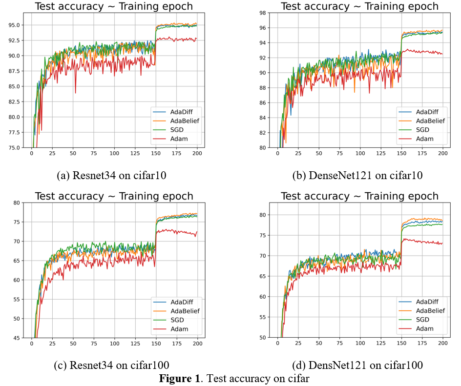

<h1 align="center">AdaDiff Optimizier</h1>

## Introduction
* Optimization methods are crucial to train deep neural networks. Adaptive optimization methods, especially Adam, are wildly used because they aren’t sensitive to the selection of learning rate and converge fast. Recent work point out Adam has a performance gap with SGD and even not converge because of the unstable and extreme learning rates. Many variants of Adam are proposed to solve the problem, such as AMSGrad, AdaBound and AdaBelief. In this paper, we propose a new variant of Adam, called AdaDiff. AdaDiff computing gradient descent step size by the exponential moving average(EMA) of gradient and differential of gradients aiming to make the training of networks more stable. We compare our method with other optimizers on various tasks. The results show AdaDiff outperforms Adam and minimizes the performance gap with SGD. 

## Algorithm

    

* In this section, we introduce our method, called AdaDiff, which is a new variant of Adam. The Pseudo codes of  Adam and AdaDiff are provided in algorithm 1 and algorithm 2 respectively. We can see that the biggest difference is the computing of . In Adam, the  is equaling to the EMA of  ; In AdaDiff, the  is equaling to the EMA of  . We believe the introduction of  can make the training of neural networks more stable. Intuitively, when the gradients change a lot, AdaDiff adopts a small step size compared to Adam. In addition, AdaDiff changes the position of  according to the suggestion of  AdaBelief. The aim is to employ a low bound on learning rates. In fact, AdaDiff can be roughly regarded as SGD with the learning rate equaling to  when the gradients become very small during the last stages of the training of networks. 

## Experiments

Code is base on:

* https://github.com/juntang-zhuang/Adabelief-Optimizer
* https://github.com/Luolc/AdaBound

#### CIFAR10 and CIFAR100

* Experiment is base on torch1.6.0

* Parameter Settings for all methods are shown in the following table

* | lr   | beta1 | beta2 | eps  | weight decay | batch size |
  | ---- | ----- | ----- | ---- | ------------ | ---------- |
  | 1e-3 | 0.9   | 0.999 | 1e-8 | 5e-4         | 128        |

* **Results:**

  
    
  	
  

#### Penn Treebank

* Experiment is base on torch1.6.0

* Parameter Settings  shown in the following table

* | model        | lr                  | beta1 | beta2 | eps                                 | weight decay | batch size |
  | ------------ | ------------------- | ----- | ----- | ----------------------------------- | ------------ | ---------- |
  | 2-layer LSTM | 1e-2| 0.9   | 0.999 | 1e-8(AdaDiff and AdaBelief are 1e-16) | 1.2e-6       | 20         |
  | 2-layer LSTM | 1e-2 | 0.9   | 0.999 | 1e-8(AdaDiff and AdaBelief are 1e-16) | 1.2e-6       | 20         |

* **Results:**

  
    
  	
  

 

## To do

* More experiments will be conduct, such as image classification on ImageNet, GAN and Transfomer. The results will be published in this repository in the future.
